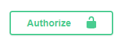
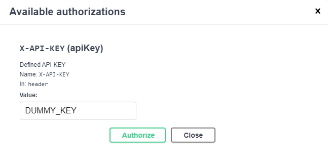

# S3 Manager

## Description

API to manage basic interaction with an [S3](https://aws.amazon.com/s3) Bucket. Build with [NestJS](https://nestjs.com) for practice purpose and reuse in another projects.

## To check API working go to:

https://s3-manager.willdv.site

## Installation

### Install dependencies

```bash
npm install
```

### Configure dev.env/prod.env file:

```bash
PORT="CUSTOM_PORT" #OPTIONAL
AWS_REGION="YOUR_AWS_REGION"
AWS_ACCESS_KEY="YOUR_ACCESS_KEY"
AWS_SECRET_KEY="YOUR_SECRET_KEY"
AWS_BUCKET_NAME="YOUR_BUCKET_NAME"
S3_URL="YOUR_BUCKET_BASE_URL" #OR CONFIGURED CLOUDFRONT URL
ALLOWED_API_KEYS="CUSTOM_ALLOWED_API_KEYS"
```

## Running the app

```bash
# development
$ npm run start

# watch mode
$ npm run start:dev

# production mode
$ npm run start:prod
```

## Test

```bash
# unit tests
$ npm run test

# e2e tests
$ npm run test:e2e

# test coverage
$ npm run test:cov
```

## Trying the app

Run the app and access to app URL. By default http://127.0.0.1:8082

You can try GET methods without setting an API KEY.

To try POST, PUT and DELETE:

1. Access to login form with Authorize button

   

2. Set API KEY you defined on ALLOWED_API_KEYS .env
   
